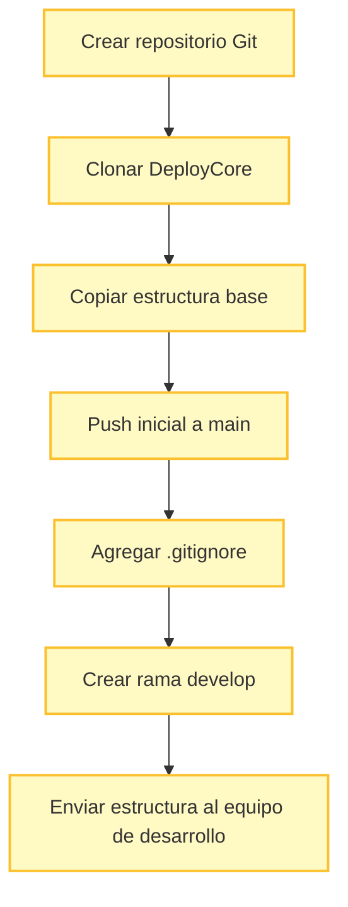
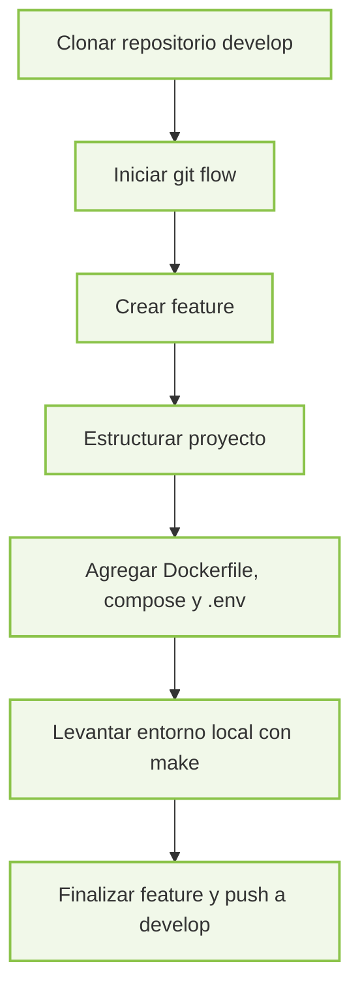
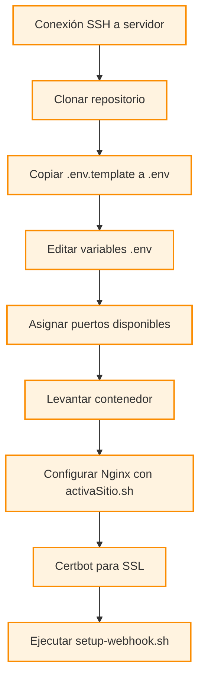

```mermaid
flowchart TD
    classDef paso fill:#e0f7fa,stroke:#00acc1,stroke-width:2px;

    subgraph "🚀 Lider de Proyecto"
        A[Crear repositorio Git]:::paso --> B[Clonar DeployCore]:::paso --> C[Copiar estructura base]:::paso
        C --> D[Push inicial a main]:::paso --> E[Agregar .gitignore]:::paso --> F[Crear rama develop]:::paso
        F --> G[Enviar estructura al equipo de desarrollo]:::paso
    end
    subgraph "🐣 Desarrollo"
        G --> H[Crear repositorio en Git]:::paso --> I[Crear rama develop]:::paso --> J[Clonar en local]:::paso
        J --> K[Inicializar git flow]:::paso --> L[Crear feature/estructura base]:::paso --> M[Agregar Dockerfile y .env]:::paso
        M --> N[Probar docker-compose local]:::paso --> O[Hacer push a develop]:::paso
    end
    subgraph "🚀 Producción"
        O --> P[SSH al servidor]:::paso --> Q[Clonar repo en /var/www/]:::paso
        Q --> R[Crear .env desde template]:::paso --> S[Asignar puertos libres]:::paso
        S --> T[Configurar y ejecutar make up]:::paso --> U[Activar sitio Nginx]:::paso
        U --> V[Instalar certificado SSL]:::paso --> W[Ejecutar setup-webhook.sh]:::paso --> X[Configurar webhook Git]:::paso
        X --> Y[✔ Proyecto desplegado]:::paso
    end
```

# 📘 DeployCore
<h4>
✨ DeployCore es una plantilla base diseñada para estandarizar y automatizar el ciclo de vida de desarrollo y despliegue de proyectos, sin importar el lenguaje o tecnología utilizada. Este entorno proporciona una estructura modular y escalable que integra buenas prácticas de DevOps, incluyendo scripts para CI/CD, contenedores Docker, configuración de hooks para despliegue automático, y utilidades de automatización mediante Makefile.
 
 Está dividido en dos enfoques complementarios:
 
 👨‍💻 **Para desarrolladores**: guía paso a paso para estructurar un nuevo proyecto, integrarlo con esta plantilla, definir su entorno local y preparar su código para despliegues automatizados.
 
 🧰 **Para administradores de servidores**:proporciona instrucciones claras para configurar entornos de producción, instalar paquetes esenciales, exponer servicios con Nginx, y asegurar aplicaciones con certificados SSL.

 DeployCore facilita la colaboración entre desarrollo y operaciones, reduciendo tiempos de integración y eliminando configuraciones manuales innecesarias.
</h4>

---

## 📑 Índice

1. [🧱 Estructura del Proyecto](#estructura-del-proyecto)
2. [🛠️ Comandos disponibles (Makefile)](#comandos-disponibles-makefile)
3. [📦 Requisitos Previos Paquetes por Rol](#requisitos-previos)
4. [🌀 Ciclo Completo de Proyecto con DeployCore](#ciclo-completo)
5. [👨‍💻 Para Lider de Proyecto](#liderProyecto)
6. [👨‍💻 Para Desarrolladores](#desarrolladores)
7. [🧰 Para Administradores de Servidor de Despliegue](#admin-server)
8. [📌 Notas](#notas)
9. [✅ Buenas Prácticas en Commits](#buenas-practicas-en-commits)
10. [👤 Autor](#autor)

---


## 🧱  Estructura del Proyecto <a name="estructura-del-proyecto"></a>

A continuación se describe la estructura principal de un proyecto 

```text
myproject/
   ├── backend/                     # Aplicación Backend
   |     └── README.md              # Documentacion de directorio
   ├── docs/                        # Documentación
   |     └── README.md              # Documentacion de directorio
   ├── frontend/                    # Aplicación Frontend
   |     └── README.md              # Documentacion de directorio
   ├── static/                      # Archivos estáticos
   |     ├── .env.template          # Plantilla de variables de entorno
   |     └── README.md              # Documentacion de directorio
   ├── .gitignore                   # Exclusión de archivos en Git
   ├── activaSitio.sh               # Script para dar de alta aplicacion en Nginx
   ├── Makefile                     # Automatización con Make
   ├── puerto-disponible.sh         # Script para buscar puertos libres en servidor
   ├── docker-compose.yml           # Orquestación local
   ├── Dockerfile                   # Imagen base del proyecto
   ├── README.md                    # Documentación principal
   ├── setup-dockerization          # Script de creacion de archivos Docker (solo para proyectos DJANGO)
   ├── setup-webhook.sh             # Script de configuración de webhook
   └── setup-webhook.sh.sig         # Firma para validar integridad del script
```

---


## 🛠️ Comandos disponibles (Makefile) <a name="comandos-disponibles-makefile"></a>

| Comando              | Descripción                                         |
|----------------------|-----------------------------------------------------|
| `make project`        | Muestra el nombre del proyecto                      |
| `make up`             | Levanta los contenedores Docker                     |
| `make down`           | Detiene los contenedores                            |
| `make logs`           | Muestra logs en tiempo real                         |
| `make clean`          | Limpia volúmenes y contenedores huérfanos           |
| `make rebuild`        | Reconstruye imágenes Docker sin caché               |
| `make setup-webhook`  | Instala Webhook para redeploy de app                |

---

## 📦  Requisitos Previos Paquetes por Rol <a name="requisitos-previos"></a>

| Rol            | Paquetes/Tools                                                                 |
|----------------|----------------------------------------------------------------------------------|
| Desarrollador  | git, docker, docker-compose, make, editor de texto                             |
| Admin Servidor | git, docker, docker-compose, make, nginx, certbot, acceso por SSH              |

---


## 🌀 Ciclo Completo de Proyecto con DeployCore <a name="ciclo-completo"></a>



---

## 🚀 Preparación Inicial del Proyecto <a name="liderProyecto"></a> 
**Responsable: Líder de Proyecto**

Este proceso debe ser realizado **únicamente por el líder de proyecto**, quien se encargará de:

- Crear el repositorio desde cero
- Integrar los scripts y estructura de **DeployCore**
- Realizar las configuraciones iniciales necesarias
- Dejar la rama `develop` lista para uso del equipo de desarrollo

---

### 🧭 Flujo para Líder de Proyecto



### 🔧 1. Crear Repositorio y Rama Principal (`main`)

1. Crear un nuevo repositorio vacío en tu plataforma Git (GitHub, GitLab, etc.).
2. Clonarlo en tu máquina local:
```bash
git clone https://turepo.com/usuario/proyecto.git
cd proyecto
```

---

### ⚙️ 2. Integrar DeployCore al Repositorio (en rama `main`)

#### 2.1 Clonar y copiar archivos base de DeployCore

```bash
git clone https://github.com/GtrujilloTS/deployCore.git temp-folder
mv temp-folder/* .
rm -rf temp-folder
```

#### 2.2 Agregar y confirmar los archivos iniciales

```bash
git add Makefile setup-webhook.sh setup-webhook.sh.sig deploy-api.sh setup-dockerization.sh DeployCore.md activaSitio.sh puerto-disponible.sh
git commit -m "CI: Integración inicial de DeployCore"
git push origin main
```

---

### 🛡️ 3. Configurar `.gitignore` para excluir scripts sensibles

> ⚠️ **Importante**: Algunos archivos del entorno de despliegue requieren permisos especiales en el servidor. Tras su integración inicial, deben excluirse del control de versiones para evitar conflictos o errores de permisos.

#### 3.1 Agregar al `.gitignore`:

```
Makefile
setup-webhook.sh
setup-webhook.sh.sig
deploy-api.sh
.env
setup-dockerization.sh
DeployCore.md
activaSitio.sh
```

#### 3.2 Confirmar los cambios

```bash
git add .gitignore
git commit -m "CI: Ignorar archivos sensibles tras integración inicial"
git push origin main
```

---

### 🌱 4. Crear la Rama de Desarrollo (`develop`)

Una vez que la rama `main` ya contiene toda la estructura base del proyecto, crea la rama `develop`, la cual será utilizada por los desarrolladores para comenzar a trabajar:

```bash
git checkout -b develop
git push -u origin develop
```

---

### ✅ Resultado Final

Después de completar estos pasos, el repositorio estará listo con:

- Rama `main`: Contiene la estructura base del proyecto y los scripts de DeployCore (ya ignorados en `.gitignore`)
- Rama `develop`: Lista para que los desarrolladores comiencen a trabajar en nuevas funcionalidades

> 🧭 A partir de aquí, el equipo de desarrollo puede clonar el repositorio y seguir trabajando sobre `develop` usando Git Flow.


## 👨‍💻 Para Desarrolladores <a name="desarrolladores"></a>

### 🔧 Requisitos Previos

**📦 Paquetes mínimos requeridos:**
- git
- docker
- docker-compose
- make (GNU Make)
- Editor de código (VSCode recomendado)
- Acceso a un repositorio remoto (GitHub, GitLab, etc.)

**🧠 Conocimientos deseables:**
- Git Flow
- Contenerización con Docker
- Estructuración de proyectos (backend/frontend)
- Buenas prácticas de versionado y .gitignore

---

### 🧭 Flujo para Desarrolladores



### 🌿 1. Descargar Proyecto y usar Git Flow para Gestión de Ramas

1. Inicializa git flow si aún no lo has hecho:
```bash 
git clone https://turepo.com/usuario/proyecto.git
cd proyecto
git flow init
```
   Usa las configuraciones por defecto (o personaliza según tu flujo).

---

### 🛡️ 2. Configurar el archivo `.env`
Se recomienda guardar datos sencibles en archivo `.env` en cual debe ser proporcionado al admin del servidor con los datos necesarios para un ambiente productivo o QA

- Usa el archivo `.env.template` como base:

```bash
cp .env.template ../.env
```

EJemplo
- Completa los valores necesarios de tu `.env`.
    - Usuario (`ISAPI_USER`)
    - Contraseña (`ISAPI_PASSWORD`)
    - Host (`ISAPI_HOST`)
    - Nombre de la base de datos (`ISAPI_NAME`)
    - Modo (`ISAPI_DEBUG`)
    - Motor de base de datos (`ISAPI_ENGINE`)


Este archivo **no se debe versionar**. Debe ser entregado manualmente al administrador del servidor.

---

### 🐳 3. Estructura del Proyecto y Dockerización

1. Inicializa tu rama de feature:
   ```bash
   git flow feature start CodeInitial
   ```
2. **Define la estructura base del proyecto** según el lenguaje o framework utilizado (por ejemplo: Node.js, Python, Django, etc.).

3. **Genera los archivos de contenerización:**
   - Si tu proyecto es Django, puedes usar el script `setup-dockerization.sh` incluido en el repositorio para generar automáticamente:
     - `Dockerfile`
     - `docker-compose.yml`
   - Para otros entornos, deberás crear estos archivos manualmente según las necesidades del proyecto.

4. **Verifica el entorno local:**
   - Asegúrate de que el contenedor se construye y se ejecuta correctamente antes de entregar o hacer push:
     ```bash
     docker-compose up --build
     ```

   - En caso de usar `make`, puedes ejecutar:
     ```bash
     make up
     ```

✅ **Recomendación:** Antes de continuar con el flujo de integración, valida que el contenedor levanta sin errores y que el servicio funciona como se espera en local.

---

### 🚀 4. Subir Cambios a la Rama `develop`

1. Finaliza tu rama de feature:
   ```bash
   git flow feature finish CodeInitial
   ```

2. Sube los cambios a `develop`:
   ```bash
   git push origin develop
   ```

---

### 🗂️ 5. Ignorar Archivos Dockerizados en `.gitignore`

Agrega las siguientes líneas a tu archivo `.gitignore` para evitar subir archivos que pueden necesitar ser personalizados en el servidor:

```
Makefile
setup-webhook.sh
setup-webhook.sh.sig
deploy-api.sh
setup-dockerization.sh
DeployCore.md
.env
activaSitio.sh
Dockerfile
docker-compose.yml
```

📌 **Importante:**

- Los archivos `Dockerfile` y `docker-compose.yml` deben ser versionados **únicamente durante la etapa de desarrollo y prueba local**.
- Una vez validado su correcto funcionamiento, se recomienda ignorarlos para evitar conflictos en entornos productivos.
- Esto se debe a que el administrador del servidor podría necesitar modificar puertos, volúmenes o configuraciones de red para adaptarlos al entorno de despliegue.

⚠️ Ignorar estos archivos previene que los `git pull` automáticos del webhook sobrescriban configuraciones críticas del entorno productivo.

---


### 📋 Checklist de Entregables del Desarrollador al Admin del Servidor

| Item                              | Detalles                                                                 |
|-----------------------------------|--------------------------------------------------------------------------|
| ✅ Código del proyecto            | Backend, frontend y archivos necesarios                                 |
| ✅ Dockerfile                     | Imagen base del servicio                                                 |
| ✅ docker-compose.yml             | Orquestación de contenedores                                             |
| ✅ Makefile                       | Comandos automatizados                                                   |
| ✅ Scripts de despliegue          | setup-webhook.sh, activaSitio.sh, deploy-api.sh, etc.                    |
| ✅ .env.template                  | Plantilla con las variables de entorno necesarias                       |
| ✅ Documentación                  | README.md, instrucciones de despliegue y uso                            |
| ✅ Rama main actualizada          | Código validado listo para producción                                   |
| ✅ Validación local               | Confirmar que el contenedor levanta correctamente antes de entregarlo   |

🔐 **Importante**: el archivo `.env` real **no debe versionarse**, debe enviarse de forma privada (correo, mensajería segura, etc.).

---


## 🧰 Para Administradores de Servidor de Despliegue <a name="admin-server"></a>

### 🔧 Requisitos Previos

**📦 Paquetes mínimos requeridos:**

Asegúrate de tener los siguientes paquetes instalados:

- `git` – Control de versiones.
- `docker` – Contenedores para ejecutar aplicaciones.
- `docker-compose` – Orquestación de múltiples contenedores.
- `make` – Automatización de tareas definidas en `Makefile`.
- `nginx` – Servidor web y proxy inverso.
- `certbot` – Certificados SSL de Let's Encrypt.
- Acceso **SSH** al servidor.

**🧠 Conocimientos Recomendados:**

- Administración de **Nginx**.
- Seguridad básica: **SSL**, manejo de **puertos**, archivos `.env`.
- Gestión de sistemas **Linux**.
- Monitoreo con **Portainer**, **Watchtower** u otras herramientas.

---

### 📂 Archivos del Proyecto

| Archivo                  | Descripción                                                                 |
|--------------------------|-----------------------------------------------------------------------------|
| `.env.template`          | Plantilla de variables de entorno. Copiar como `.env` y completar.         |
| `Makefile`               | Contiene comandos automatizados (`make deploy`, `make up`, etc.).           |
| `setup-webhook.sh`       | Script para configurar webhook de despliegue automático desde Git.          |
| `Dockerfile`             | Define la imagen base de la aplicación.                                     |
| `docker-compose.yml`     | Orquesta todos los servicios del proyecto.                                  |
| `activaSitio.sh`         | Activa configuración de Nginx para el sitio.                                |
| `deploy-api.sh`          | Script opcional para desplegar una API externa adicional.                   |
| `setup-dockerization.sh` | Automatiza la creación de archivos base para dockerizar un nuevo proyecto.  |

---

### 🧭 Flujo Despliegue para Administradores



---

### 🖥️ 1.  Despliegue en el Servidor
1. Conéctate al servidor vía SSH.
2. Dirígete al directorio donde están alojadas las páginas:
   ```bash
   cd /var/www/CD_WEB/
   ```
3. Clona el repositorio:
   ```bash
   git clone https://turepo.com/usuario/proyecto.git
   cd proyecto
   ```

### ⚙️ 2. **Configura variables de entorno:**

El desarrollador o lider de proyecto debera proporcionar las keys y valores validos que se deban configurar o tomar en cuenta para el proyecto antes de continuar con el deploy

```bash
cp .env.template .env
nano .env
```

### ⚙️ 3. Asignación de Puertos

1. Ejecuta el script para obtener puertos disponibles:
   ```bash
   ./puerto-disponible.sh
   ```
2. Modifica tu `Dockerfile` y `docker-compose.yml` con los puertos obtenidos.

---

### 🧪 4. Levantar Sitio en el Servidor

1. Ejecuta Docker Compose:
   ```bash
   docker-compose up -d --build
   ```
    o si usas make

    ```bash
    make up
    ```
    Esto desplegará tu sitio en el puerto local definido.
---


### 🌐 5. Configuración Nginx o el proxy reverso con los archivos incluidos.

1. Ve a:
   ```bash
   cd /etc/nginx/sites-available/
   ```
2. Activa la configuración del sitio:
   ```bash
   sudo ./activaSitio.sh nombre-del-config
   ```

   Si el sh activaSitio.sh  no esta en el directorio podra copiar el que se encuentra en el directorio del repositorio activaSitio.sh 
---

#### 🔐 Certificados SSL

```bash
sudo certbot --nginx -d dominio.com
```

---

### 🪝 6. Configuración del Webhook

Puedes configurar el webhook utilizando el `Makefile` provisto en este repositorio (opción recomendada) o de forma manual.


#### ⚙️ Opción A: Usar el `Makefile`

Si estás utilizando el `Makefile` del repositorio, simplemente ejecuta el siguiente comando:

```bash
make setup-webhook branch=nombre_rama
```

- Si no se especifica una rama, se usará `main` por defecto.

##### 🔍 Ejemplos:
```bash
make setup-webhook branch=develop   # Usará la rama 'develop'
make setup-webhook                  # Usará la rama 'main' (por defecto)
```

✅ Ideal para levantar el hook en ramas como `develop` para entornos de pruebas, o `main` para entornos de producción.

---

#### 🛠️ Opción B: Ejecución Manual

Si no utilizas `make`, puedes configurar el hook manualmente en dos pasos:

##### 1. Dar permisos de ejecución al script

```bash
sudo chmod +x setup-webhook.sh
```

##### 2. Ejecutar el script con la rama deseada

```bash
sudo ./setup-webhook.sh nombre_rama
```

- Si no se especifica una rama, se usará `main` por defecto.

##### 🔍 Ejemplos:
```bash
sudo ./setup-webhook.sh develop   # Usará la rama 'develop'
sudo ./setup-webhook.sh          # Usará la rama 'main' (por defecto)
```

✅ Esta opción es útil si no deseas usar `make` o estás integrando el hook en un entorno más personalizado.

---

### 🔗 7. Configurar el Webhook en Git

Una vez ejecutado el script, este devolverá una **URL única** para el webhook. Deberás:

1. Ingresar a la configuración de tu repositorio en GitHub/GitLab/etc.
2. Ir a la sección **Webhooks**.
3. Crear un nuevo webhook.
4. Pegar la URL generada.
5. Configura los siguientes valores:
  - **Payload URL**: `http://<tu-dominio-o-ip>:<puerto-configurado>/webhook`
  - **Content type**: `application/json`
  - **Secret**: Usa el token que devolvio la ejecusion del sh
  - **Events**: Seleccionar los eventos que deseas monitorear (por ejemplo, `push`).

---

### 🧠 Consideraciones Críticas para el Pull Automático y Seguridad del Despliegue

El sistema de despliegue automatizado mediante webhook está **configurado para realizar `git pull` desde la rama `main` o la rama designada explícitamente**. Esta estrategia garantiza un flujo de trabajo controlado y predecible, evitando conflictos o errores en producción.
#### 🧩 Flujo de Despliegue Controlado

- 🛡️ El webhook se activa automáticamente al hacer `push` en la rama configurada.
- ✅ Solo se despliega el código que ha sido aprobado y mergeado, idealmente mediante **Pull Requests** o **Merge Requests**.
- 📌 Este enfoque permite administrar versiones de forma limpia usando **releases**, y facilita auditoría de cambios.

> ⚠️ **Importante:** asegúrate de hacer `merge` correctamente hacia `main` (o la rama de despliegue configurada) antes de hacer `push`, para que el hook pueda aplicar el `git pull` sin errores.

---

#### 🔐 Buenas Prácticas de Seguridad y Operación

- ✅ **Evita cambios no versionados directamente en el servidor.**  
  Archivos sin seguimiento por Git o con cambios locales pueden provocar errores durante el `git pull`.

- 🧪 **Verifica el funcionamiento del webhook antes de liberar.**  
  Realiza un `git push` de prueba para validar que la automatización del despliegue responde correctamente.

- 🔐 **Protege archivos sensibles y variables de entorno.**  
  Usa `.gitignore` para excluir archivos como `.env`, configuraciones locales o claves privadas.

- 🌐 **Aísla los servicios en redes privadas.**  
  Asegúrate de definir correctamente los puertos expuestos y de limitar el acceso innecesario.

- 🔍 **Monitorea los contenedores y servicios.**  
  Implementa herramientas como **Portainer** o **Watchtower** para observar logs, estado de servicios y actualizaciones automáticas.

---


### 🔧 Checklist para el Administrador del Servidor

| Paso                              | Descripción                                                                 |
|-----------------------------------|-----------------------------------------------------------------------------|
| ✅ SSH al servidor                | Acceso al servidor de despliegue                                            |
| ✅ Clonar el repositorio          | Desde GitHub/GitLab, en /var/www/WEB/<proyecto>                         |
| ✅ Copiar .env.template           | Renombrar a .env y llenar con datos reales                                 |
| ✅ Asignar puertos disponibles    | Usar puerto-disponible.sh para evitar conflictos                           |
| ✅ Configurar Dockerfile          | Ajustar puertos, rutas si es necesario                                     |
| ✅ Ejecutar make up o docker-compose | Levantar el contenedor                                                 |
| ✅ Configurar Nginx               | Usar activaSitio.sh o editar sites-available manualmente                  |
| ✅ Instalar certificado SSL       | Usar certbot para HTTPS                                                    |
| ✅ Ejecutar setup-webhook.sh      | Para automatizar el redeploy por Git                                       |
| ✅ Configurar Webhook en Git      | Crear URL en GitHub/GitLab con el token generado                           |

---

## 📌 Notas <a name="notas"></a>
Este proyecto está pensado como punto de partida. Puedes extenderlo con pruebas automatizadas, análisis de calidad, o integración con servicios en la nube.

---

## ✅ Buenas Prácticas en Commits <a name="buenas-practicas-en-commits"></a>

Basado en el flujo de trabajo [GitFlow](https://www.atlassian.com/es/git/tutorials/comparing-workflows/gitflow-workflow):

- 👾 `FIX:` Correcciones a bugs, fallas de integridad o errores de programación.
- ♻️ `REFACTOR:` Refactorización o mejora de funcionalidades existentes.
- ➕ `FEAT:` Nueva funcionalidad implementada.
- 📝 `SQL:` Cambios en base de datos, archivos `.sql`, migraciones.
- 👔 `STYLE:` Cambios relacionados a estilo o estética.
- 📚 `DOCS:` Documentación, minutas, acuerdos.
- 🧪 `TEST:` Adición o modificación de pruebas sin afectar el código base.
- 🔩 `CHORE:` Mantenimiento general del código.
- ☠️ `DELETE:` Eliminación de funciones o archivos.
- 🔄 `CI:` Cambios en integración continua.

---

## 👤 Autor
Proyecto desarrollado por:  
**[Giovanni Trujillo Silvas](https://github.com/GtrujilloTS)**  
Licencia: **MIT**

---

¿Te gustaría contribuir? ¡Haz un fork o abre un issue!
