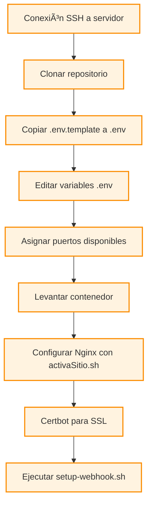

```mermaid
flowchart TD
    classDef paso fill:#e0f7fa,stroke:#00acc1,stroke-width:2px;
    subgraph "🐣 Desarrollo"
        A[Crear repo Git]:::paso --> B[Crear rama develop]:::paso --> C[Clonar en local]:::paso
        C --> D[Inicializar git flow]:::paso --> E[Crear feature]:::paso --> F[Estructura proyecto]:::paso
        F --> G[Agregar Dockerfile]:::paso --> H[Test local docker-compose]:::paso
    end

    subgraph "🚀 Integración"
        H --> I[Clonar DeployCore]:::paso --> J[Integrar scripts Makefile/Webhook]:::paso
        J --> K[Push develop]:::paso --> L[SSH a servidor]:::paso
    end

    subgraph "🔧 Servidor"
        L --> M[Clonar repo en /var/www/WEB/]:::paso
        M --> N[Ejecutar puerto-disponible.sh]:::paso
        N --> O[Configurar Dockerfile y compose]:::paso
        O --> P[Levantar contenedor]:::paso
        P --> Q[Configurar Nginx con activaSitio.sh]:::paso
        Q --> R[Ejecutar setup-webhook.sh]:::paso
        R --> S[Configurar webhook en Git]:::paso --> T[✔ Proyecto desplegado]:::paso
    end
```

# 📘 DeployCore
<h4>
✨ DeployCore es una plantilla base diseñada para estandarizar y automatizar el ciclo de vida de desarrollo y despliegue de proyectos, sin importar el lenguaje o tecnología utilizada. Este entorno proporciona una estructura modular y escalable que integra buenas prácticas de DevOps, incluyendo scripts para CI/CD, contenedores Docker, configuración de hooks para despliegue automático, y utilidades de automatización mediante Makefile.
 
 Está dividido en dos enfoques complementarios:
 
 👨‍💻 **Para desarrolladores**: guía paso a paso para estructurar un nuevo proyecto, integrarlo con esta plantilla, definir su entorno local y preparar su código para despliegues automatizados.
 
 🧰 **Para administradores de servidores**:proporciona instrucciones claras para configurar entornos de producción, instalar paquetes esenciales, exponer servicios con Nginx, y asegurar aplicaciones con certificados SSL.

 DeployCore facilita la colaboración entre desarrollo y operaciones, reduciendo tiempos de integración y eliminando configuraciones manuales innecesarias.
</h4>

---

## 📑 Índice

1. [🧱 Estructura del Proyecto](#estructura-del-proyecto)
2. [🛠️ Comandos disponibles (Makefile)](#comandos-disponibles-makefile)
3. [📦 Requisitos Previos Paquetes por Rol](#requisitos-previos)
4. [🌀 Ciclo Completo de Proyecto con DeployCore](#ciclo-completo)
5. [👨‍💻 Para Desarrolladores](#desarrolladores)
6. [🧰 Para Administradores de Servidor de Despliegue](#admin-server)
7. [📌 Notas](#notas)
8. [✅ Buenas Prácticas en Commits](#buenas-practicas-en-commits)
9. [👤 Autor](#autor)

---


## 🧱  Estructura del Proyecto <a name="estructura-del-proyecto"></a>

A continuación se describe la estructura principal de un proyecto 

```text
myproject/
├── front/                       # Aplicación Frontend
├── backend/                     # Aplicación Backend
├── static/                      # Archivos estáticos
├── docs/                        # Documentación
├── .gitignore                   # Exclusión de archivos en Git
├── README.md                    # Documentación principal
├── .env.template                # Plantilla de variables de entorno
├── Makefile                     # Automatización con Make
├── docker-compose.yml           # Orquestación local
├── Dockerfile                   # Imagen base del proyecto
├── setup-webhook.sh             # Script de configuración de webhook
└── setup-webhook.sh.sig         # Firma para validar integridad del script
```

---


## 🛠️ Comandos disponibles (Makefile) <a name="comandos-disponibles-makefile"></a>

| Comando              | Descripción                                         |
|----------------------|-----------------------------------------------------|
| `make project`        | Muestra el nombre del proyecto                      |
| `make up`             | Levanta los contenedores Docker                     |
| `make down`           | Detiene los contenedores                            |
| `make logs`           | Muestra logs en tiempo real                         |
| `make clean`          | Limpia volúmenes y contenedores huérfanos           |
| `make rebuild`        | Reconstruye imágenes Docker sin caché               |
| `make setup-webhook`  | Instala Webhook para redeploy de app                |

---

## 📦  Requisitos Previos Paquetes por Rol <a name="requisitos-previos"></a>

| Rol            | Paquetes/Tools                                                                 |
|----------------|----------------------------------------------------------------------------------|
| Desarrollador  | git, docker, docker-compose, make, editor de texto                             |
| Admin Servidor | git, docker, docker-compose, make, nginx, certbot, acceso por SSH              |

---


## 🌀 Ciclo Completo de Proyecto con DeployCore <a name="ciclo-completo"></a>



---

## 👨‍💻 Para Desarrolladores <a name="desarrolladores"></a>

### 🔧 Requisitos Previos

**📦 Paquetes mínimos requeridos:**
- git
- docker
- docker-compose
- make (GNU Make)
- Editor de código (VSCode recomendado)
- Acceso a un repositorio remoto (GitHub, GitLab, etc.)

**🧠 Conocimientos deseables:**
- Git Flow
- Contenerización con Docker
- Estructuración de proyectos (backend/frontend)
- Buenas prácticas de versionado y .gitignore

---

### 🧭 Flujo para Desarrolladores

```mermaid
flowchart TD
    classDef paso fill:#f1f8e9,stroke:#8bc34a,stroke-width:2px;
    A[Clonar repositorio]:::paso --> B[Ejecutar make init]:::paso --> C[Copiar .env.template a .env]:::paso
    C --> D[Agregar código fuente]:::paso --> E[Pruebas con docker-compose]:::paso --> F[Commit y push a develop]:::paso
```




### 🔧 1. Crear Repositorio y Rama de Desarrollo

1. Crear un repositorio en tu plataforma de Git (GitHub, GitLab, etc.).
2. Clonar el repositorio a tu máquina local:
```bash
git clone https://turepo.com/usuario/proyecto.git
cd proyecto
```
3. Crear la rama `develop` y subirla:
```bash
git checkout -b develop
git push -u origin develop
```

---

### 🌿 2. Usar Git Flow para Gestión de Ramas

1. Inicializa git flow si aún no lo has hecho:
```bash
git flow init
```
   Usa las configuraciones por defecto (o personaliza según tu flujo).

---

### 🧪 3. Integración DeployCore
#### 1️⃣ Crear una nueva rama de feature DeployCore:
```bash
git flow feature start DeployCore
```

#### 2️⃣ Clonar DeployCore
    ```bash
    git clone https://github.com/GtrujilloTS/deployCore.git temp-folder  # Repo Actual
    mv temp-folder/* .
    rm -rf temp-folder
    ```


#### 3️⃣ Hacer Commit y Push del Script

Guarda el script en el repositorio con:

```bash
git add  Makefile setup-webhook.sh setup-webhook.sh.sig deploy-api.sh setup-dockerization.sh DeployCore.md activaSitio.sh 
git commit -m "CI:Agregar scriptS para deploy"
```
#### 4️⃣ Finalizar una nueva rama de feature DeployCore:
```bash
git flow feature finish DeployCore
git push origin develop
```
#### 5️⃣ Crear una nueva rama de feature para gitignoreDeployCore:
```bash
git flow feature start gitignoreDeployCore
```

#### 6️⃣ Ignorar el Script de DeployCore en `.gitignore`

Agrega la siguiente línea a tu archivo `.gitignore`:

```
Makefile 
setup-webhook.sh 
setup-webhook.sh.sig 
deploy-api.sh 
.env
setup-dockerization.sh 
DeployCore.md
activaSitio.sh 
```

📌 **Importante:** Los scripts requieren permisos especiales en el servidor, por lo tanto es mejor mantenerlo fuera del control de versiones después del primer uso para evitar conflictos con Git.


#### 7️⃣ Finalizar una nueva rama de feature gitignoreDeployCore:
```bash
git flow feature finish gitignoreDeployCore
git push origin develop
```

---

### 🛡️ 4. Configurar el archivo `.env`
Se recomienda guardar datos sencibles en archivo `.env` en cual debe ser proporcionado al admin del servidor con los datos necesarios para un ambiente productivo o QA

- Usa el archivo `.env.template` como base:

```bash
cp .env.template ../.env
```

EJemplo
- Completa los valores necesarios de tu `.env`.
    - Usuario (`ISAPI_USER`)
    - Contraseña (`ISAPI_PASSWORD`)
    - Host (`ISAPI_HOST`)
    - Nombre de la base de datos (`ISAPI_NAME`)
    - Modo (`ISAPI_DEBUG`)
    - Motor de base de datos (`ISAPI_ENGINE`)


Este archivo **no se debe versionar**. Debe ser entregado manualmente al administrador del servidor.

---

### 🐳 5. Estructura del Proyecto y Dockerización

1. **Define la estructura base del proyecto** según el lenguaje o framework utilizado (por ejemplo: Node.js, Python, Django, etc.).

2. **Genera los archivos de contenerización:**
   - Si tu proyecto es Django, puedes usar el script `setup-dockerization.sh` incluido en el repositorio para generar automáticamente:
     - `Dockerfile`
     - `docker-compose.yml`
   - Para otros entornos, deberás crear estos archivos manualmente según las necesidades del proyecto.

3. **Verifica el entorno local:**
   - Asegúrate de que el contenedor se construye y se ejecuta correctamente antes de entregar o hacer push:
     ```bash
     docker-compose up --build
     ```

   - En caso de usar `make`, puedes ejecutar:
     ```bash
     make up
     ```

✅ **Recomendación:** Antes de continuar con el flujo de integración, valida que el contenedor levanta sin errores y que el servicio funciona como se espera en local.

---

### 🚀 6. Subir Cambios a la Rama `develop`

1. Finaliza tu rama de feature:
   ```bash
   git flow feature finish nombre-feature
   ```

2. Sube los cambios a `develop`:
   ```bash
   git push origin develop
   ```

---

### 🗂️ 7. Ignorar Archivos Dockerizados en `.gitignore`

Agrega las siguientes líneas a tu archivo `.gitignore` para evitar subir archivos que pueden necesitar ser personalizados en el servidor:

```
Makefile
setup-webhook.sh
setup-webhook.sh.sig
deploy-api.sh
setup-dockerization.sh
DeployCore.md
.env
activaSitio.sh
Dockerfile
docker-compose.yml
```

📌 **Importante:**

- Los archivos `Dockerfile` y `docker-compose.yml` deben ser versionados **únicamente durante la etapa de desarrollo y prueba local**.
- Una vez validado su correcto funcionamiento, se recomienda ignorarlos para evitar conflictos en entornos productivos.
- Esto se debe a que el administrador del servidor podría necesitar modificar puertos, volúmenes o configuraciones de red para adaptarlos al entorno de despliegue.

⚠️ Ignorar estos archivos previene que los `git pull` automáticos del webhook sobrescriban configuraciones críticas del entorno productivo.

---


### 📋 Checklist de Entregables del Desarrollador al Admin del Servidor

| Item                              | Detalles                                                                 |
|-----------------------------------|--------------------------------------------------------------------------|
| ✅ Código del proyecto            | Backend, frontend y archivos necesarios                                 |
| ✅ Dockerfile                     | Imagen base del servicio                                                 |
| ✅ docker-compose.yml             | Orquestación de contenedores                                             |
| ✅ Makefile                       | Comandos automatizados                                                   |
| ✅ Scripts de despliegue          | setup-webhook.sh, activaSitio.sh, deploy-api.sh, etc.                    |
| ✅ .env.template                  | Plantilla con las variables de entorno necesarias                       |
| ✅ Documentación                  | README.md, instrucciones de despliegue y uso                            |
| ✅ Rama main actualizada          | Código validado listo para producción                                   |
| ✅ Validación local               | Confirmar que el contenedor levanta correctamente antes de entregarlo   |

🔐 **Importante**: el archivo `.env` real **no debe versionarse**, debe enviarse de forma privada (correo, mensajería segura, etc.).

---


## 🧰 Para Administradores de Servidor de Despliegue <a name="admin-server"></a>

### 🔧 Requisitos Previos

**📦 Paquetes mínimos requeridos:**

Asegúrate de tener los siguientes paquetes instalados:

- `git` – Control de versiones.
- `docker` – Contenedores para ejecutar aplicaciones.
- `docker-compose` – Orquestación de múltiples contenedores.
- `make` – Automatización de tareas definidas en `Makefile`.
- `nginx` – Servidor web y proxy inverso.
- `certbot` – Certificados SSL de Let's Encrypt.
- Acceso **SSH** al servidor.

**🧠 Conocimientos Recomendados:**

- Administración de **Nginx**.
- Seguridad básica: **SSL**, manejo de **puertos**, archivos `.env`.
- Gestión de sistemas **Linux**.
- Monitoreo con **Portainer**, **Watchtower** u otras herramientas.

---

### 📂 Archivos del Proyecto

| Archivo                  | Descripción                                                                 |
|--------------------------|-----------------------------------------------------------------------------|
| `.env.template`          | Plantilla de variables de entorno. Copiar como `.env` y completar.         |
| `Makefile`               | Contiene comandos automatizados (`make deploy`, `make up`, etc.).           |
| `setup-webhook.sh`       | Script para configurar webhook de despliegue automático desde Git.          |
| `Dockerfile`             | Define la imagen base de la aplicación.                                     |
| `docker-compose.yml`     | Orquesta todos los servicios del proyecto.                                  |
| `activaSitio.sh`         | Activa configuración de Nginx para el sitio.                                |
| `deploy-api.sh`          | Script opcional para desplegar una API externa adicional.                   |
| `setup-dockerization.sh` | Automatiza la creación de archivos base para dockerizar un nuevo proyecto.  |

---

### 🧭 Flujo Despliegue para Administradores



---

### 🖥️ 1.  Despliegue en el Servidor
1. Conéctate al servidor vía SSH.
2. Dirígete al directorio donde están alojadas las páginas:
   ```bash
   cd /var/www/CD_WEB/
   ```
3. Clona el repositorio:
   ```bash
   git clone https://turepo.com/usuario/proyecto.git
   cd proyecto
   ```

### ⚙️ 2. **Configura variables de entorno:**

El desarrollador o lider de proyecto debera proporcionar las keys y valores validos que se deban configurar o tomar en cuenta para el proyecto antes de continuar con el deploy

```bash
cp .env.template .env
nano .env
```

### ⚙️ 3. Asignación de Puertos

1. Ejecuta el script para obtener puertos disponibles:
   ```bash
   ./puerto-disponible.sh
   ```
2. Modifica tu `Dockerfile` y `docker-compose.yml` con los puertos obtenidos.

---

### 🧪 4. Levantar Sitio en el Servidor

1. Ejecuta Docker Compose:
   ```bash
   docker-compose up -d --build
   ```
    o si usas make

    ```bash
    make up
    ```
    Esto desplegará tu sitio en el puerto local definido.
---


### 🌐 5. Configuración Nginx o el proxy reverso con los archivos incluidos.

1. Ve a:
   ```bash
   cd /etc/nginx/sites-available/
   ```
2. Activa la configuración del sitio:
   ```bash
   sudo ./activaSitio.sh nombre-del-config
   ```

   Si el sh activaSitio.sh  no esta en el directorio podra copiar el que se encuentra en el directorio del repositorio activaSitio.sh 
---

#### 🔐 Certificados SSL

```bash
sudo certbot --nginx -d dominio.com
```

---

### 🪝 6. Configuración del Webhook

Puedes configurar el webhook utilizando el `Makefile` provisto en este repositorio (opción recomendada) o de forma manual.


#### ⚙️ Opción A: Usar el `Makefile`

Si estás utilizando el `Makefile` del repositorio, simplemente ejecuta el siguiente comando:

```bash
make setup-webhook branch=nombre_rama
```

- Si no se especifica una rama, se usará `main` por defecto.

##### 🔍 Ejemplos:
```bash
make setup-webhook branch=develop   # Usará la rama 'develop'
make setup-webhook                  # Usará la rama 'main' (por defecto)
```

✅ Ideal para levantar el hook en ramas como `develop` para entornos de pruebas, o `main` para entornos de producción.

---

#### 🛠️ Opción B: Ejecución Manual

Si no utilizas `make`, puedes configurar el hook manualmente en dos pasos:

##### 1. Dar permisos de ejecución al script

```bash
sudo chmod +x setup-webhook.sh
```

##### 2. Ejecutar el script con la rama deseada

```bash
sudo ./setup-webhook.sh nombre_rama
```

- Si no se especifica una rama, se usará `main` por defecto.

##### 🔍 Ejemplos:
```bash
sudo ./setup-webhook.sh develop   # Usará la rama 'develop'
sudo ./setup-webhook.sh          # Usará la rama 'main' (por defecto)
```

✅ Esta opción es útil si no deseas usar `make` o estás integrando el hook en un entorno más personalizado.

---

### 🔗 7. Configurar el Webhook en Git

Una vez ejecutado el script, este devolverá una **URL única** para el webhook. Deberás:

1. Ingresar a la configuración de tu repositorio en GitHub/GitLab/etc.
2. Ir a la sección **Webhooks**.
3. Crear un nuevo webhook.
4. Pegar la URL generada.
5. Configura los siguientes valores:
  - **Payload URL**: `http://<tu-dominio-o-ip>:<puerto-configurado>/webhook`
  - **Content type**: `application/json`
  - **Secret**: Usa el token que devolvio la ejecusion del sh
  - **Events**: Seleccionar los eventos que deseas monitorear (por ejemplo, `push`).

---

### 🧠 Consideraciones Críticas para el Pull Automático y Seguridad del Despliegue

El sistema de despliegue automatizado mediante webhook está **configurado para realizar `git pull` desde la rama `main` o la rama designada explícitamente**. Esta estrategia garantiza un flujo de trabajo controlado y predecible, evitando conflictos o errores en producción.
#### 🧩 Flujo de Despliegue Controlado

- 🛡️ El webhook se activa automáticamente al hacer `push` en la rama configurada.
- ✅ Solo se despliega el código que ha sido aprobado y mergeado, idealmente mediante **Pull Requests** o **Merge Requests**.
- 📌 Este enfoque permite administrar versiones de forma limpia usando **releases**, y facilita auditoría de cambios.

> ⚠️ **Importante:** asegúrate de hacer `merge` correctamente hacia `main` (o la rama de despliegue configurada) antes de hacer `push`, para que el hook pueda aplicar el `git pull` sin errores.

---

#### 🔐 Buenas Prácticas de Seguridad y Operación

- ✅ **Evita cambios no versionados directamente en el servidor.**  
  Archivos sin seguimiento por Git o con cambios locales pueden provocar errores durante el `git pull`.

- 🧪 **Verifica el funcionamiento del webhook antes de liberar.**  
  Realiza un `git push` de prueba para validar que la automatización del despliegue responde correctamente.

- 🔐 **Protege archivos sensibles y variables de entorno.**  
  Usa `.gitignore` para excluir archivos como `.env`, configuraciones locales o claves privadas.

- 🌐 **Aísla los servicios en redes privadas.**  
  Asegúrate de definir correctamente los puertos expuestos y de limitar el acceso innecesario.

- 🔍 **Monitorea los contenedores y servicios.**  
  Implementa herramientas como **Portainer** o **Watchtower** para observar logs, estado de servicios y actualizaciones automáticas.

---


### 🔧 Checklist para el Administrador del Servidor

| Paso                              | Descripción                                                                 |
|-----------------------------------|-----------------------------------------------------------------------------|
| ✅ SSH al servidor                | Acceso al servidor de despliegue                                            |
| ✅ Clonar el repositorio          | Desde GitHub/GitLab, en /var/www/WEB/<proyecto>                         |
| ✅ Copiar .env.template           | Renombrar a .env y llenar con datos reales                                 |
| ✅ Asignar puertos disponibles    | Usar puerto-disponible.sh para evitar conflictos                           |
| ✅ Configurar Dockerfile          | Ajustar puertos, rutas si es necesario                                     |
| ✅ Ejecutar make up o docker-compose | Levantar el contenedor                                                 |
| ✅ Configurar Nginx               | Usar activaSitio.sh o editar sites-available manualmente                  |
| ✅ Instalar certificado SSL       | Usar certbot para HTTPS                                                    |
| ✅ Ejecutar setup-webhook.sh      | Para automatizar el redeploy por Git                                       |
| ✅ Configurar Webhook en Git      | Crear URL en GitHub/GitLab con el token generado                           |

---

## 📌 Notas <a name="notas"></a>
Este proyecto está pensado como punto de partida. Puedes extenderlo con pruebas automatizadas, análisis de calidad, o integración con servicios en la nube.

---

## ✅ Buenas Prácticas en Commits <a name="buenas-practicas-en-commits"></a>

Basado en el flujo de trabajo [GitFlow](https://www.atlassian.com/es/git/tutorials/comparing-workflows/gitflow-workflow):

- 👾 `FIX:` Correcciones a bugs, fallas de integridad o errores de programación.
- ♻️ `REFACTOR:` Refactorización o mejora de funcionalidades existentes.
- ➕ `FEAT:` Nueva funcionalidad implementada.
- 📝 `SQL:` Cambios en base de datos, archivos `.sql`, migraciones.
- 👔 `STYLE:` Cambios relacionados a estilo o estética.
- 📚 `DOCS:` Documentación, minutas, acuerdos.
- 🧪 `TEST:` Adición o modificación de pruebas sin afectar el código base.
- 🔩 `CHORE:` Mantenimiento general del código.
- ☠️ `DELETE:` Eliminación de funciones o archivos.
- 🔄 `CI:` Cambios en integración continua.

---

## 👤 Autor
Proyecto desarrollado por:  
**[Giovanni Trujillo Silvas](https://github.com/GtrujilloTS)**  
Licencia: **MIT**

---

¿Te gustaría contribuir? ¡Haz un fork o abre un issue!
